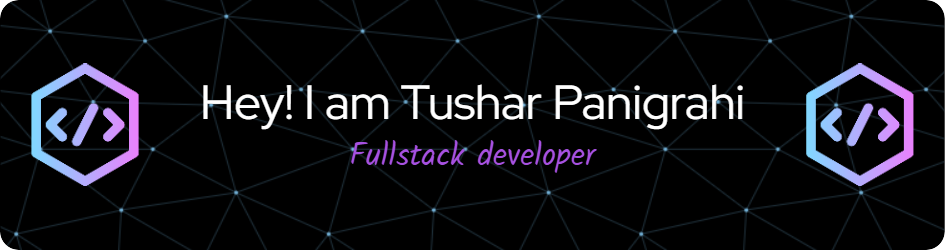

  

# 💫 About Me:

- 🔭 Currently engaged in Full Stack Development.  
- 🌱 Constantly honing skills in **practicing DSA in C++ and DevOps.**  
- 👯 Open to collaborating on **full stack projects and Event Management.**  
- 🤝 Seeking assistance and exploration in **DevOps practices.**  
- 💭 Passionate about programming languages and all things related to Web Development.  
- 😍 Enthusiast in **Listening to music, coding, and gaming.**  
- 📫 Reach me at **tusharpanigrahi@gmail.com** for any inquiries.

## 🌐 Socials:
 

# 💻 Tech Stack:
                       
# 📊 GitHub Stats:
<table>

<td align="center">

   
 

  
  
</td>

</table>

## 🏆 GitHub Trophies

### ✍️ Random Dev Quote

<!-- Proudly created with GPRM ( https://gprm.itsvg.in ) -->
